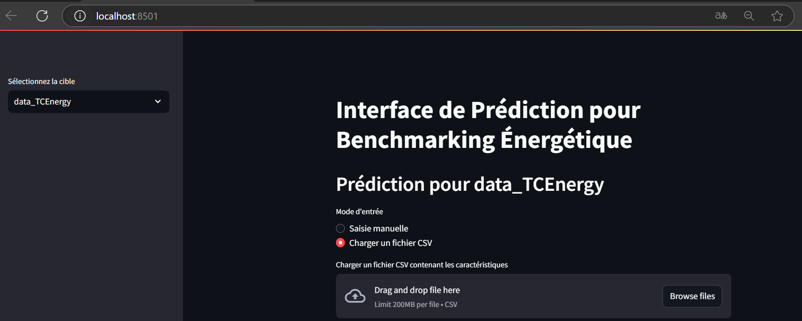

# Projet de Stage au Machine Learning

Anticiper les besoins en consommation électrique de bâtiments 

## Description du Projet

Ce projet se compose de deux programmes principaux :

### 1. Programme d’entraînement et de sauvegarde (`Prediction_energy.py`)

Ce script permet de :
- Charger et prétraiter les données issues de deux fichiers CSV.
- Fusionner et nettoyer le jeu de données.
- Dériver les variables cibles `data_TCEnergy` et `data_EmissionsCO2`.

Pour chaque cible, un sous-ensemble est extrait, les données sont séparées et standardisées, et plusieurs modèles sont entraînés.  
Ici, le **Gradient Boosting Regressor** est choisi comme « meilleur modèle » pour chaque cible (vous pouvez adapter selon vos performances).  
Un pipeline est créé en combinant le **StandardScaler** ajusté sur les données d’entraînement et le modèle, puis sauvegardé au format `.pkl` avec le module `pickle`.

### 2. Interface Streamlit (`Application.py`)

Cette application permet à l’utilisateur de :
- Sélectionner la cible souhaitée (soit `data_TCEnergy`, soit `data_EC2`).
- Charger les caractéristiques via une saisie manuelle (une chaîne de valeurs séparées par des virgules) ou un fichier CSV.
- Charger le modèle correspondant depuis le fichier `.pkl` et réaliser une prédiction basée sur les données fournies.


## Prérequis

Assurez-vous d'avoir installé Python 3.x ainsi que les librairies suivantes :

- [numpy](https://numpy.org/)
- [pandas](https://pandas.pydata.org/)
- [matplotlib](https://matplotlib.org/)
- [seaborn](https://seaborn.pydata.org/)
- [scikit-learn](https://scikit-learn.org/stable/)
- [pickle](https://docs.python.org/3/library/pickle.html)
- [streamlit](https://streamlit.io/)

Vous pouvez installer les dépendances avec la commande suivante :

```bash
pip install numpy pandas matplotlib seaborn scikit-learn streamlit
